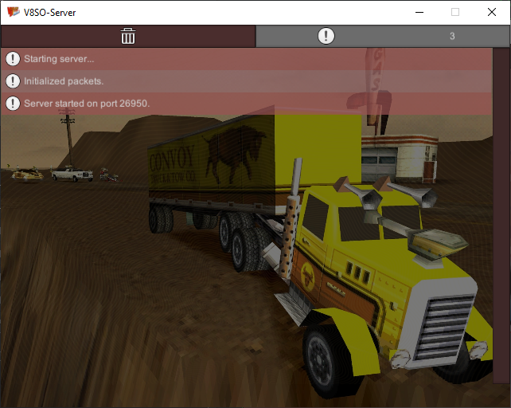
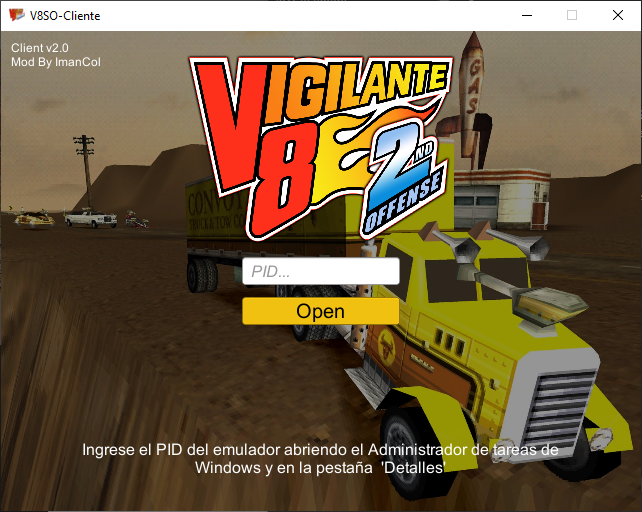
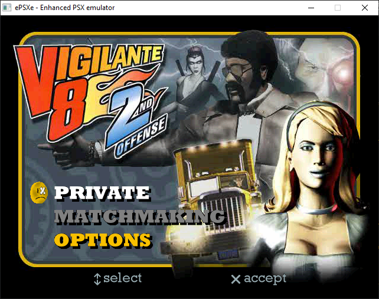
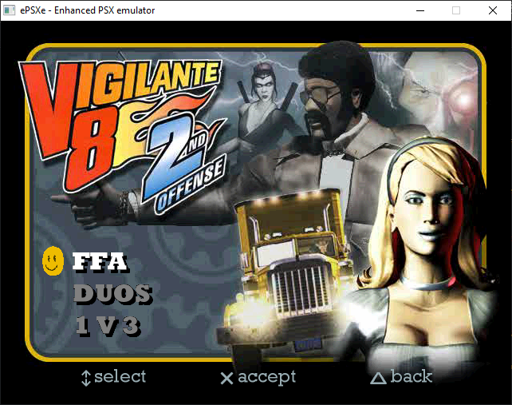
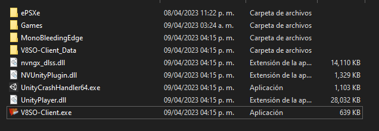

# Vig2Online

Actualmente solo admite lobbies privados.

Server:

Client:

V8SO-Emulate ePSXe:

## Patching

Utilice VigOnlineX64.poc.exe o VigOnlineX86.poc.exe para parchear el archivo .bin original de NTSC-US (slus-00868) Track 01.

Al actualizar desde versiones anteriores de este mod, debe parchear su archivo .bin nuevamente para estar actualizado.

## Configuracion del Cliente

Obtenga el ejecutable de 32 o 64 bits del V8SO-Client. Cree 2 carpetas junto al ejecutable (ePSXe y Games)

En la carpeta ePSXe copia el emulador. En la carpeta Games copia el juego Vigilante 8 2nd Seccond Offense

Cuando lance el juego, leera el archivo .cue contenido en la carpeta Games.
Asegurate de tener la bios del emulador.
Asegurate de tener V8SO Server abierto para conectarse con el cliente.

#Disfruta!

## Donate
Esto esta destinado a mejoras, me podrias ayudar con una donacion para hecharle mas ganas
[Paypal](paypal.me/imancol)

## Contributing
Pull requests are welcome. For major changes, please open an issue first to discuss what you would like to change.

## Copyright

Original Fork - https://github.com/stefanvranjes/Vig2Online

2BrightSparks Pte. Ltd., 2004-2021

In-game Debug Console for Unity 3D https://github.com/yasirkula/UnityIngameDebugConsole

Unity Technologies 2004-2021

Activision Publishing, Inc. 1979-2021

