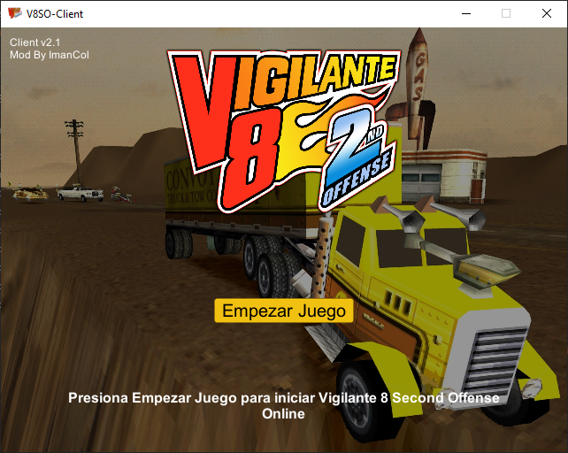

# Vig2Online

Actualmente solo admite lobbies privados.

Server:

Client:

V8SO-Emulate ePSXe:

## Patching

Utilice VigOnlineX64.poc.exe o VigOnlineX86.poc.exe para parchear el archivo .bin original de NTSC-US (slus-00868) Track 01.

Al actualizar desde versiones anteriores de este mod, debe parchear su archivo .bin nuevamente para estar actualizado.

## Contributing
Pull requests are welcome. For major changes, please open an issue first to discuss what you would like to change.

## Copyright

Original Fork - https://github.com/stefanvranjes/Vig2Online

2BrightSparks Pte. Ltd., 2004-2021

In-game Debug Console for Unity 3D https://github.com/yasirkula/UnityIngameDebugConsole

Unity Technologies 2004-2021

Activision Publishing, Inc. 1979-2021

